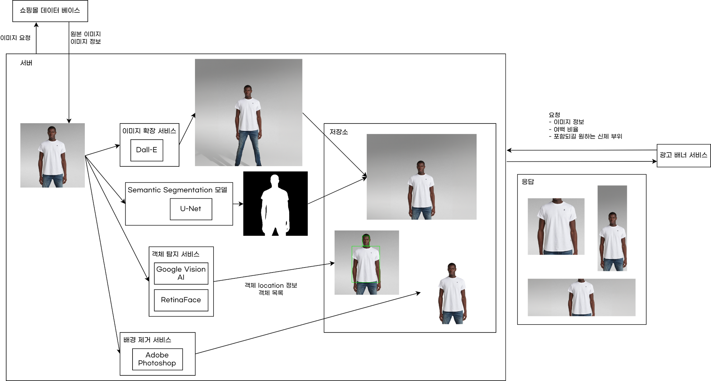

# 이미지 배경 확장 and 이미지 자동 Crop 앱
2023년 1학기에 제가 학교에서 진행했던 프로젝트. "이미지 배경 확장, 이미지 자동 Crop 서비스"의 repo입니다.

## 서비스 구조

이미지 처리를 하는 Flask app, 이미지 Crop 영역 연산, 쇼핑몰 스크래핑으로 원본 이미지 획득, 클라이언트로의 응답을 담당하는 Spring App으로 나뉘어져 있습니다. Flask와 Spring은 API를 통해 통신합니다. 원래는 하나의 언어로 개발하려고 했으나, 피치못할 사정으로 인해 Spring과 Flask를 같이 사용하게 되어 이런 형태가 되었씁니다. 이왕 이렇게 된거 마이크로 서비스 아키텍처를 경험했다고 생각하기로 했습니다.  

자세한 내용은 각 앱의 폴더를 확인해주세요.

### [Flask App](image_processing_app) task list
- [x] 객체 탐지 기능 구현
- [x] 안면 탐지 기능 구현
- [x] 이미지 아웃페인팅 기능 구현

### Spring App task list
- [ ] 원본 이미지 스크래핑하고 저장하는 기능
- [ ] 이미지 크롭 로직 개발