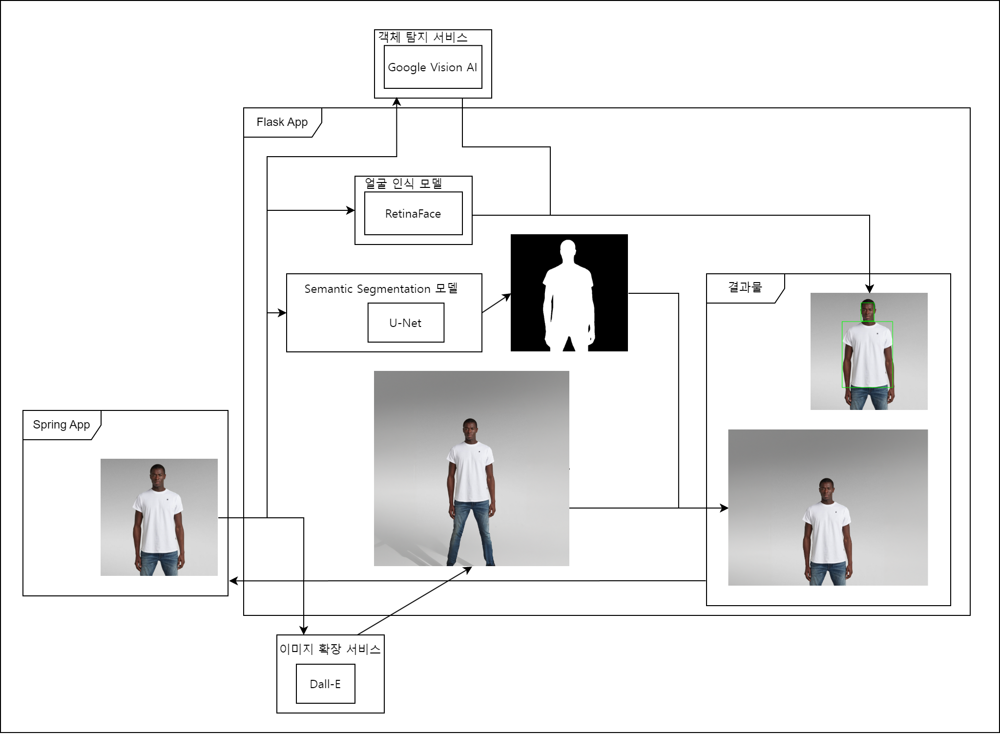

# 이미지 프로세싱 앱
# 소개
이미지 자동 Crop 앱에 사용될 이미지를 처리하고 객체 인식 데이터를 제공하는 로컬 서버입니다.



할 줄 아는 것이 Python 뿐이었던 저는 Python으로 이미지 처리 개발을 시작습니다. 그런데 서버를 Spring으로 구축해야 하는 상황이 오고 만 것입니다. java로 모조리 새로 구현하기는 싫었던 저는, 기존 코드를 기반으로 로컬 서버를 구축하고, Spring 서버가 API를 통해 이 것과 통신을 하도록 했습니다. 일종의 마이크로 서비스 아키텍처(Micro Service Architecture)라고 할 수 있겠네요.

아무튼, 해당 앱은 이미지 자동 Crop 앱을 위한 로컬 마이크로 서비스입니다.

## Requirements
작업 디렉토리를 `image_processing_app`로 변경하고 아래 명령어를 실행합니다. 
```bash
pip install -r requirements.txt
```
## 실행 방법
작업 디렉토리를 `image_processing_app/src`로 변경하고 아래 명령어를 실행합니다. 하지만 실행에 앞서 .env를 통해 환경 변수를 등록해야 합니다. 아래를 참고하세요.
```Bash
python app.py
```
## Docker를 이용한 실행
Docker를 이용하면, 별도의 패키지 설치나 작업 디렉토리 변경없이 서버를 실행할 수 있습니다. 제가 Docker Hub에 올려놓은 이미지를 `pull`한 뒤에, `run`하면 됩니다. 하지만 실행에 앞서 .env를 통해 환경 변수를 등록해야 합니다. 아래를 참고하세요.
```bash
docker pull henry914/image-processing-flask-app:0.1
docker run -p 5000:5000 --env-file .env henry914/image-processing-flask-app:0.1
```

## 환경 변수 설정법
`.env` 파일을 생성하고 OpenAI API의 key를 입력해야 합니다.
```
DallE_API_KEY=<Dall-E 서비스 키 json의 위치>
GOOGLE_APPLICATION_CREDENTIALS=../etc/secrets/google_key.json
```
`.env` 파일을 생성했다면 다음의 과정에 따라 배치합니다.
### `python app.py`을 통해 실행하는 경우
작업 디렉토리 `image_processing_app/src`에 `.env` 파일을 배치합니다.
### Docker 이미지를 pull 해서 실행하는 경우
`docker run`을 실행하는 작업 디렉토리에 `.env` 파일을 배치합니다.

## Google API키 등록 방법
위의 과정을 전부 따라도 FaceDetection API를 사용하는 것은 불가능합니다. Google API service key를 발급받고, 이를 배치해야 하기 때문입니다. `https://console.cloud.google.com/`에서 서비스를 등록하고, service key를 발급받을 수 있습니다.
### `python app.py`을 통해 실행하는 경우
다음 명령어를 실행해줍니다.
```
export GOOGLE_APPLICATION_CREDENTIALS=../etc/secrets/google_key.json
```
그리고 `image_processing_app/etc/secrets` 경로를 만들고, service_key를 배치합니다
### Docker 이미지를 pull 해서 실행하는 경우
`docker run`을 실행할 때, `-v` 옵션을 통해 호스트의 파일을 Docker 컨테이너에 전달하면 됩니다.
```
docker run -p 5000:5000 -v /.../(service key가 있는 폴더 디렉토리):/app/etc/secrets --env-file .env henry914/image-processing-flask-app
```
Docker의 볼륨과 환경 변수를 사용하는 방법을 알고 계시다면, 직접 하시는 것이 더 좋습니다.